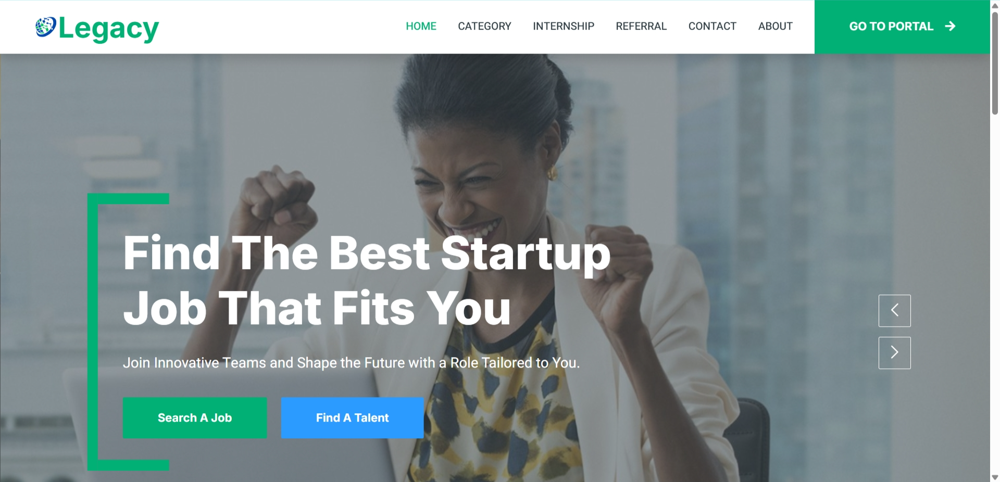
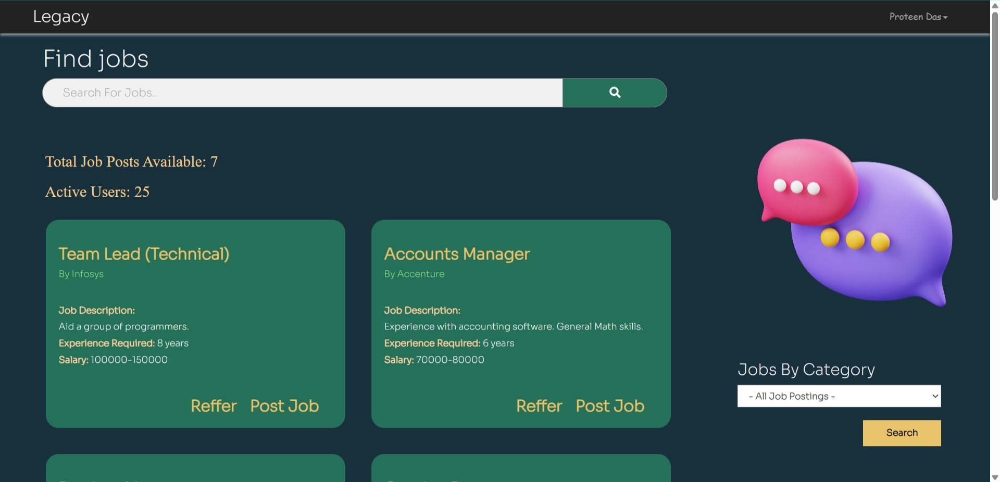
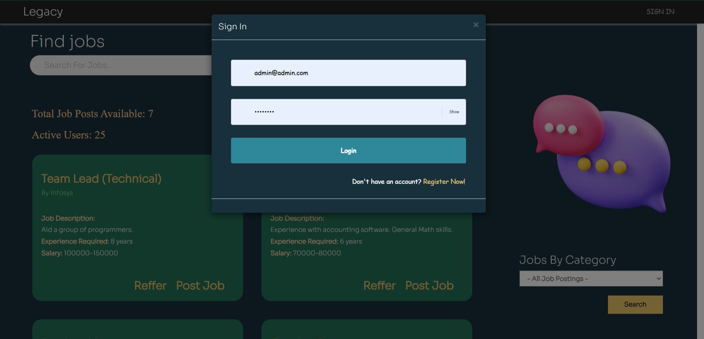

# Legacy

Legacy is a platform dedicated to helping students and recent graduates streamline their job search by providing a centralized hub for job listings, referrals, and career connections.

- **Our Vision**
  1. **Centralized Platform**: A one-stop platform where candidates can find job openings from multiple sources, including Telegram, WhatsApp, and Discord.
  2. **Referral Section**: A space for candidates to connect directly with employees who can provide referrals, simplifying the referral process.
  3. **Time-Saving Tool**: Designed to save candidates' time by reducing the need to surf various platforms and websites.

- **Features**
  - **Entities**
    - **Admin**: Full access for managing job postings, accepting/rejecting applications, and overseeing user accounts.
    - **Employer**: Can post jobs and review applicants.
    - **Jobseeker**: Can view job listings and apply directly.
  - **Landing Page**: A comprehensive page about Legacy with a contact form for inquiries.
  - **Custom Navigation**: Different navigation options for each user type (Admin, Employer, Jobseeker).
  - **Explore More**: Additional features to enhance the user experience, which can be explored further on the platform.

---

### Screenshots

**Landing Page**  
A snapshot of the landing page that provides an overview of Legacy’s mission and features.

**Jobs Portal Page**  
An organized list of available job opportunities tailored for different user roles.

**Sign In Page**  
Secure login interface for platform access.

**Registration Panel**  
User-friendly registration interface for new users.

**Admin Dashboard**  
Dashboard for Admins to manage job postings, applications, and user access.

**Employer Dashboard**  
Employer-focused dashboard for managing job postings and applicant data.

**Jobseeker Dashboard**  
Jobseeker interface with tools for job search and application management.

